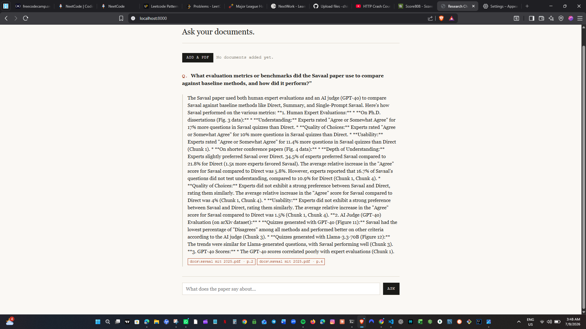

# RAG Document Chatbot
A chatbot that answers questions about PDFs research papers, technical docs,
whatever you give it grounded entirely in the documents you upload, with
page level source citations on every answer.
I built this to actually understand RAG (Retrieval-Augmented Generation) from
the ground up, instead of just calling a framework’s one-liner and hoping it
works. Every step in the pipeline is a plain function you can read top to
bottom.
 ## What it does
1. Upload a PDF
2. it gets split into chunks, embedded, and stored in a local ChromaDB vector store
3. You ask a question in plain English
4. The most relevant chunks are retrieved and handed to an LLM, which is
instructed to answer only from that context the response shows
exactly which document and page it came from
 ## Why RAG
A general purpose LLM can’t answer questions about a document it’s never
seen, and it’ll happily make something up if you ask anyway. RAG fixes this
by retrieving the actual relevant text first, then telling the model to
answer using only that retrieved context nothing else. This is the same
pattern behind most production AI products that answer questions over
private or specialized data, not just a toy trick.
I tested this directly: I asked the bot something that wasn’t in the
uploaded paper (“what programming language is this written in?”) and it
correctly said the context didn’t contain that information instead of
guessing. That’s the behavior that actually matters for a RAG system
not being right, but knowing when it doesn’t know.


 ## Demo
 
  
 
 ## Architecture
```
PDF upload
   │
   ▼
PyPDFLoader (load_documents)        one Document per page, with source + page metadata
   │
   ▼
RecursiveCharacterTextSplitter      overlapping ~1000-char chunks
   │
   ▼
Gemini Embeddings (gemini-embedding-001)
   │
   ▼
ChromaDB, persisted to disk         vector store
   │
   ▼  (at query time)
similarity_search(question, k=4)    top 4 most relevant chunks
   │
   ▼
Prompt: "answer using only this context"  →  gemini-2.5-flash
   │
   ▼
Answer + source citations  →  FastAPI response  →  frontend
```
Stack: Python, FastAPI, LangChain, ChromaDB, Google Gemini API
Setup
```bash
# 1. Clone and enter the project
git clone https://github.com/chisom-cyprian/rag-document-chatbot.git
cd rag-document-chatbot

# 2. Create a virtual environment
python -m venv venv
source venv/bin/activate   # Windows: venv\Scripts\activate

# 3. Install dependencies
pip install -r requirements.txt

# 4. Add your Gemini API key (free at https://aistudio.google.com/apikey)
cp .env.example .env
# edit .env and paste in your real key

# 5. Ingest a PDF (drop a PDF into docs/ first)
python -m app.core.ingest

# 6. Run the server
uvicorn app.main:app --reload
```
Open http://localhost:8000 in your browser. Upload a PDF, then ask it questions.
## Project structure
```
app/
├── core/
│   ├── config.py       # settings, API key loading
│   ├── ingest.py        # PDF -> chunks -> embeddings -> ChromaDB
│   └── rag_chain.py     # retrieval + answer generation + citations
├── api/
│   └── routes.py        # /api/upload and /api/chat endpoints
└── main.py                # FastAPI app entrypoint
static/
└── index.html              # frontend (vanilla HTML/CSS/JS)
docs/                        # uploaded PDFs land here
chroma_db/                    # persisted vector store (gitignored)
```
## Known limitations
I’d rather list these honestly than pretend the project is more finished
than it is:
 - Re-ingests all documents in `docs/` on every upload instead of
incrementally adding just the new file. Fine for a small personal
document set, not efficient at scale.
 - No conversation memory. Each question is independent it’s not a
multi-turn conversation with follow-up context.
 - No chunk-level relevance scoring shown to the user, just which
document/page matched, not how confident the match was.
  - Single ChromaDB collection shared across all documents. No per-user or
per-project isolation.
## Possible extensions
- Add conversation memory so follow-up questions like “what about section
3?” actually work
 - Show similarity scores next to each source citation
  - Support incremental ingestion instead of full re-ingestion on every upload
 - Swap Gemini for a local model via Ollama for a fully offline version
 - Add a “delete document” endpoint to remove a paper from the index
